# Kafka-postman
Your Kafka topics organizer



## The problem I came to solve
When I wrote the [Pensu](https://github.com/iyuvalk/pensu) service for metrics anomaly detection and prediction, I quickly realized that since this service reads the metrics from a Kafka topic and outputs its predictions and anomaly scores to another Kafka topic, it will need some way to scale horizontally. Since just adding more instances of the service cannot guarantee that once a service starts to get a specific metric it will continue to receive all the datapoints for that metric from that moment on, I decided to write this service to help distribute data from one source topic to several destination topics based on some configurable logic.

## Common or possible use cases for this tool (If you have more ideas for use cases, or you would like to share your use case with me - I'd love to know and add them here)
1. Pull data from one topic and distribute it evenly between multiple destination topics on the same or on other Kafka cluster by using round-robin or random logic as a mean for load balancing between consumers.
   1. Examples:
      1. Use one Kafka cluster for handling connections to producers and for storing incoming data to disk and another cluster for consumers to split the load (and perhaps use different, more cost-effective disks) and use Kafka-Postman to distribute the data from the incoming topic on one cluster to various destination topics on the destination cluster. 
1. Pull data from one topic, use a regex to extract the destination topic of the pulled data and send the data to that topic.
   1. Examples:
      1. Pull graphite metrics like 'acme.servers.eu-west-1.webservers.public_website.frontend.cpu.usage.percent 50 1593772056' and distribute them between multiple consumers (maybe for ML analyzers) by function (i.e. webservers, databases, AD, etc.), by component (i.e cpu, disk, network, memory, etc.), by location (i.e. eu-west-1, us-east-1, etc.) or by any other criteria. 
1. Pull data from a Kafka topic and distribute it evenly between multiple topics but still keep similar messages together in the same destination topic.
   1. Examples:
      1. Pull metrics and send them to multiple analyzers as even as possible while keeping metrics from the same server in the same destination topic.
1. Pull data from a Kafka topic and distribute it to other topics selected from all topics on the Kafka cluster by trying to match them against a regex.
   1.Examples:
      1. Your application handles three different types of data: tweets, posts and comments, each type has a topic to which the raw data is sent (i.e. tweets-in) and multiple topics used by content processors (i.e. tweets-processor1, tweets-processor2 ...). You use this tool in three different processes, one for each data type.
1. Pull data from one topic and distribute it between multiple destination topics while detecting "dead" or unresponsive consumers and in which case data that should have been sent to the "dead" consumers will be distributed among the remaining consumers.
   1. Examples:
      1. You have metrics coming in on one source topic and multiple consumers (that you built or have access to their source code) that process the data , and you would like the metrics to be distributed between consumers as evenly as possible while keeping similar metrics together (like 3 above) while still detecting "dead" consumers and redistributing the data among the other consumers.  
1. Same as 5 above except messages should be distributed based on a number generated by the consumers rather than just being evenly distributed among consumers.
   1. Examples:
      1. Distribute messages between consumers based on the load on each consumer while keeping similar messages in the same consumer's topic and detecting "dead" consumers and redistributing the data among the other consumers.

## The use case that led me to develop this project
The [Pensu](https://github.com/iyuvalk/pensu) project that I've built comprised of a Docker/Kubernetes ready service that is designed to pull metrics from a Kafka topic and then use the HTM algorithm by Numenta to generate predictions and anomaly scores and push them to another Kafka topic. Both the metrics, the predictions and the anomaly scores are written in the Graphite line format, like this: 
```
acme.it.servers.webservers.public_website1.cpu.user_time <value> <timestamp_in_unixtime>
```

Since that this service pulls the metrics data from a single topic, if the number of metrics or their sample rate will increase, it would have to have the ability to scale, but if you'd simply run multiple instances of the pensu service to share the load and they would all pull from the same Kafka topic, then some of the datapoints for the same metric will be consumed by instance A while other datapoints of the same metric will be consumed by other instances. This of course will not allow the pensu services to make accurate predictions and anomaly detections. But, since that pensu is able to be configured to periodically send the topic it is listening on to a Kafka topic, we can install as many instances of this project, Kafka-postman, and configure it to discover topics based on a "topics topic" which is the same topic that pensu will report the topic it listens on to, this service will periodically get the topics each pensu instance is listening on, and by using a regex to extract the metric name from the metric line, it will randomly (or by using a round robin logic) select a topic for every newly seen metric and then it will keep sending the all the datapoints of every metric to the same pensu instance. Problem solved!
Also, since that it is using a sliding cache mechanism, if one of the [Pensu](https://github.com/iyuvalk/pensu) instances dies, it would stop sending the topic on which it is listening on to the "topics topic" and the Kafka-postman will eventually select another pensu instance to handle the datapoints of the metrics used to be handled by the now dead pensu instance.

## The basic algorithm
This service implements the following basic algorithm:
1. Get config from the environment variables
1. Connect to source and destination Kafka servers (build consumer by using `KAFKA_POSTMAN_KAFKA_CONSUMER_SERVER`, `KAFKA_POSTMAN_KAFKA_CONSUMER_CLIENT_ID`, `KAFKA_POSTMAN_KAFKA_CONSUMER_GROUP_ID` and `KAFKA_POSTMAN_KAFKA_CONSUMER_DEFAULT_OFFSET`. build producer by using `KAFKA_POSTMAN_KAFKA_PRODUCER_SERVER`, `KAFKA_POSTMAN_KAFKA_PRODUCER_CLIENT_ID` and `KAFKA_POSTMAN_KAFKA_PRODUCER_GROUP_ID`)
1. Pull a message from `KAFKA_POSTMAN_SOURCE_TOPIC` (or wait for a message to arrive)
1. If needed (according to `KAFKA_POSTMAN_TOPICS_DISCOVERY_INTERVAL` and whether the list of destination topics is empty or not) - (Re-)discover destination topics (based on `KAFKA_POSTMAN_TOPICS_DISCOVERY_METHOD`)
   1. If the number of seconds that have passed since the last discovery is greater than the `KAFKA_POSTMAN_TOPICS_DISCOVERY_INTERVAL` or the list of discovered topics or the list of all Kafka topics seen is empty, discover destination topics by following the following steps:
      1. Get all Kafka topics from the server specified by `KAFKA_POSTMAN_KAFKA_PRODUCER_SERVER`
      1. If `KAFKA_POSTMAN_TOPICS_DISCOVERY_METHOD` is "REGEX":
         1. Go over all Kafka topics and select those which match the regex set by `KAFKA_POSTMAN_DISCOVERY_REGEX`
         1. Use the result as the destination topics list
      1. If `KAFKA_POSTMAN_TOPICS_DISCOVERY_METHOD` is "MANUAL":
         1. Split the value of `KAFKA_POSTMAN_DISCOVERY_MANUAL_TOPICS_LIST` by the character specified in `KAFKA_POSTMAN_DISCOVERY_MANUAL_TOPICS_LIST_SEPARATOR`
         1. Use the result as the destination topics list
      1. If `KAFKA_POSTMAN_TOPICS_DISCOVERY_METHOD` is "TOPICS_TOPIC":
         1. Create consumer for a topic defined by `KAFKA_POSTMAN_TOPICS_DISCOVERY_TOPIC` using `KAFKA_POSTMAN_TOPICS_DISCOVERY_TOPIC_SERVER`, `KAFKA_POSTMAN_TOPICS_DISCOVERY_TOPIC_GROUP_ID` and `KAFKA_POSTMAN_TOPICS_DISCOVERY_TOPIC_CLIENT_ID` (Using this discovery method is possible if the consuming applications are using this topic to report which topic they are listening on and possibly their current load or priority)
         1. Consume messages from this topic until either no new messages received within `KAFKA_POSTMAN_TOPICS_DISCOVERY_TOPIC_MAX_WAIT_FOR_TOPICS` or the entire discovery process is taking more than `KAFKA_POSTMAN_TOPICS_DISCOVERY_TOPIC_MAX_DISCO_TIMEOUT` (in milliseconds, in both cases)
         1. If the environment variable `KAFKA_POSTMAN_TOPICS_TOPIC_MAY_CONTAIN_JSON` is true 
            1. If the current message is parsable as JSON:
               1. Add the current topic to a list of topics and sort indexes by extracting the field specified by `KAFKA_POSTMAN_TOPICS_TOPIC_TOPIC_NAME_JSON_FIELD` as the topic name, and the field specified by `KAFKA_POSTMAN_TOPICS_TOPIC_SORT_BY_JSON_FIELD` as the sort index from the JSON. 
            1. If the current message is not parsable as JSON:
               1. Switch back to non JSON mode. From now the messages will be parsed as topics. No JSON parsing will be attempted until next topics discovery.
         1. If the environment variable `KAFKA_POSTMAN_TOPICS_TOPIC_MAY_CONTAIN_JSON` is false
            1. Add the current message (which is assumed to contain the topic name on which the consumer application is listening on) to a temporary topics list.
         1. De-duplicate the temporary topics list.
         1. Use the result as the destination topics list
      1. Otherwise, panic with the message "Unknown topics discovery method. LEAVING"
      1. If `KAFKA_POSTMAN_TOPICS_DISCOVERY_METHOD` is "REGEX" and `KAFKA_POSTMAN_DISTRIBUTION_STRATEGY` is not "REGEX":
         1. If `KAFKA_POSTMAN_TOPICS_VALIDATION_VALIDATE_AGAINST_KAFKA` is true or `KAFKA_POSTMAN_TOPICS_VALIDATION_WHITELIST` is valid and not empty or `KAFKA_POSTMAN_TOPICS_VALIDATION_BLACKLIST` is valid and not empty or `KAFKA_POSTMAN_TOPICS_VALIDATION_REGEX_WHITELIST` is valid and not empty or  `KAFKA_POSTMAN_TOPICS_VALIDATION_REGEX_BLACKLIST` is valid and not empty:
            1. If `KAFKA_POSTMAN_TOPICS_VALIDATION_VALIDATE_AGAINST_KAFKA` is true, and the current topic does not appear on the list of all Kafka topics - Continue to the next topic
            1. If  the value of `KAFKA_POSTMAN_TOPICS_VALIDATION_WHITELIST` (JSON array) is valid and is not empty and does not contain the current topic - Continue to the next topic
            1. If  the value of `KAFKA_POSTMAN_TOPICS_VALIDATION_BLACKLIST` (JSON array) is valid and is not empty and contains the current topic - Continue to the next topic
            1. If  the value of `KAFKA_POSTMAN_TOPICS_VALIDATION_REGEX_WHITELIST` (JSON array) is valid and is not empty and none of the regexes on it matched the current topic - Continue to the next topic
            1. If  the value of `KAFKA_POSTMAN_TOPICS_VALIDATION_REGEX_WHITELIST` (JSON array) is valid and is not empty and one of the regexes on it matched the current topic - Continue to the next topic
            1. Add the current topic to the list of validated topics (at the end of this loop replace the list of discovered topics with the list of validated topics) 
 1. Decide on the selected destination topic (based on `KAFKA_POSTMAN_DISTRIBUTION_STRATEGY`)
   1. If `KAFKA_POSTMAN_DISTRIBUTION_STRATEGY` is "RANDOM":
      1. Selects the destination topic at random from the list of all topics found on the destination Kafka cluster.
   1. If `KAFKA_POSTMAN_DISTRIBUTION_STRATEGY` is "ROUND_ROBIN":
      1. Selects the destination topic as the next topic in order from the list of all topics found on the destination Kafka cluster. If the current topic is the last topic on the list, the first topic will be selected.
   1. If `KAFKA_POSTMAN_DISTRIBUTION_STRATEGY` is "REGEX":
      1. Extracts the destination topic from the current message by using the regex specified by `KAFKA_POSTMAN_DISTRIBUTION_REGEX` and the group index specified by `KAFKA_POSTMAN_DISTRIBUTION_REGEX_GROUP_INDEX` (for example, if the message is "acme.farm1.sylvester.web_servers.frontend1.cpu.usage.system 10 1594225115" and the value `KAFKA_POSTMAN_DISTRIBUTION_REGEX` is "^([a-z]+)\..*" and the value of `KAFKA_POSTMAN_DISTRIBUTION_REGEX_GROUP_INDEX` is 1, the topic that will be selected is "acme")
   1. Otherwise, panic with the message "Unknown message distribution method. LEAVING".
1. Handle "topic pinning" if enabled through `KAFKA_POSTMAN_TOPIC_PINNING_ENABLED` (Would keep similar messages in the same destination topic regardless of the selected distribution strategy)
   1. If `KAFKA_POSTMAN_TOPIC_PINNING_ENABLED` is true:
      1. If `KAFKA_POSTMAN_REDIS_CLUSTER_NAME` is empty (meaning there is only a single Redis server to communicate with):
         1. Generates a connection to the Redis server using the first address listed as a JSON string array in `KAFKA_POSTMAN_REDIS_ADDRESSES`, the database number specified in `KAFKA_POSTMAN_REDIS_DB_NO` and the password specified in `KAFKA_POSTMAN_REDIS_DB_PASSWORD`.
      1. If `KAFKA_POSTMAN_REDIS_CLUSTER_NAME` is not empty:
         1. Generates a connection to the Redis cluster using all addresses listed as a JSON string array in `KAFKA_POSTMAN_REDIS_ADDRESSES`, the cluster name specified in `KAFKA_POSTMAN_REDIS_CLUSTER_NAME` and the password specified in `KAFKA_POSTMAN_REDIS_DB_PASSWORD`.
      1. Create a fingerprint of the message by using `KAFKA_POSTMAN_TOPIC_PINNING_REGEX` and the list defined in `KAFKA_POSTMAN_TOPIC_PINNING_REGEX_GROUPS_INDEXES` as integers separated by a comma to extract parts of the message, create a JSON string array of the matching parts and then create an MD5 hash of the JSON string.
      1. Attempt to find the fingerprint as a key on the Redis server/cluster, if found - Use the value found for that key as the destination topic
      1. Create/update the value in Redis for this finger print to the currently selected destination topic. Set the expiration of this value in milliseconds to the value of `KAFKA_POSTMAN_TOPIC_PINNING_HASH_SLIDING_EXPIRY_MS`. 
1. Validate the selected destination topic if needed based on the values of `KAFKA_POSTMAN_TOPICS_VALIDATION_WHITELIST`, `KAFKA_POSTMAN_TOPICS_VALIDATION_BLACKLIST`, `KAFKA_POSTMAN_TOPICS_VALIDATION_REGEX_WHITELIST`, `KAFKA_POSTMAN_TOPICS_VALIDATION_REGEX_BLACKLIST` and `KAFKA_POSTMAN_TOPICS_VALIDATION_VALIDATE_AGAINST_KAFKA`
   1. If `KAFKA_POSTMAN_TOPICS_VALIDATION_VALIDATE_AGAINST_KAFKA` is true or `KAFKA_POSTMAN_TOPICS_VALIDATION_WHITELIST` is valid and not empty or `KAFKA_POSTMAN_TOPICS_VALIDATION_BLACKLIST` is valid and not empty or `KAFKA_POSTMAN_TOPICS_VALIDATION_REGEX_WHITELIST` is valid and not empty or  `KAFKA_POSTMAN_TOPICS_VALIDATION_REGEX_BLACKLIST` is valid and not empty:
      1. If `KAFKA_POSTMAN_TOPICS_VALIDATION_VALIDATE_AGAINST_KAFKA` is true, and the current topic does not appear on the list of all Kafka topics - Log warning and set the destination topic to the value of `KAFKA_POSTMAN_DEFAULT_TARGET_TOPIC`
      1. If  the value of `KAFKA_POSTMAN_TOPICS_VALIDATION_WHITELIST` (JSON array) is valid and is not empty and does not contain the current topic - Log warning and set the destination topic to the value of `KAFKA_POSTMAN_DEFAULT_TARGET_TOPIC`
      1. If  the value of `KAFKA_POSTMAN_TOPICS_VALIDATION_BLACKLIST` (JSON array) is valid and is not empty and contains the current topic - Log warning and set the destination topic to the value of `KAFKA_POSTMAN_DEFAULT_TARGET_TOPIC`
      1. If  the value of `KAFKA_POSTMAN_TOPICS_VALIDATION_REGEX_WHITELIST` (JSON array) is valid and is not empty and none of the regexes on it matched the current topic - Log warning and set the destination topic to the value of `KAFKA_POSTMAN_DEFAULT_TARGET_TOPIC`
      1. If  the value of `KAFKA_POSTMAN_TOPICS_VALIDATION_REGEX_WHITELIST` (JSON array) is valid and is not empty and one of the regexes on it matched the current topic - Log warning and set the destination topic to the value of `KAFKA_POSTMAN_DEFAULT_TARGET_TOPIC`
1. Publish the current message to the currently selected destination topic and then go back to 3.

### The following environment variables control this service:
#### General variables
Environment variable                                      | Meaning                                                                                                                              | Default
----------------------------------------------------------|--------------------------------------------------------------------------------------------------------------------------------------|----------------------------------------------------------
`KAFKA_POSTMAN_LOG_LEVEL`                                 | The log level for this service as a number (1=ERROR, 2=WARN, 3=INFO, 4=DEBUG, 5=VERBOSE)                                             | `3`
`KAFKA_POSTMAN_LOGGING_FORMAT`                            | The logging format that will be used.                                                                                                | `timestamp=%s;module=smart-onion_%s;method=%s;severity=%s;state=%s;metric/metric_family=%s;exception_msg=%s;exception_type=%s;message=%s`
`KAFKA_POSTMAN_SOURCE_TOPIC`                              | The Kafka topic that will be used by the service to pull data from (and to distribute that data to the available destination topics) | `metrics`
`KAFKA_POSTMAN_DEFAULT_TARGET_TOPIC`                      | The default destination topic that will be used if Kafka-Postman cannot decide to which topic to send the current message to         | `_unknown_recipient`
`KAFKA_POSTMAN_KAFKA_CONSUMER_SERVER`                     | The server (such as localhost:9020) from which the service will consume the source data.                                             | `kafka:9092`
`KAFKA_POSTMAN_KAFKA_CONSUMER_CLIENT_ID`                  | The client ID that will be used when consuming messages from the source server. Can include the placeholders such as "{{#instance_id}}" and "{{#time_started}}" or "{{#uuid}}" that are automatically resolved to the instance id (a unique identifier that is generated when the service launches) and to the unix time on which the service started or to a unique UUID. Respectively. | `{{#uuid}}`
`KAFKA_POSTMAN_KAFKA_CONSUMER_GROUP_ID`                   | The group ID that will be used when consuming messages from the source server. Can include the placeholders such as "{{#instance_id}}" and "{{#time_started}}" or "{{#uuid}}" that are automatically resolved to the instance id (a unique identifier that is generated when the service launches) and to the unix time on which the service started or to a unique UUID. Respectively. | `kafka-postman`
`KAFKA_POSTMAN_KAFKA_CONSUMER_DEFAULT_OFFSET`             | The position in the source topic to start reading from. Can be 'end' or 'beginning'                                                  | `end`
`KAFKA_POSTMAN_KAFKA_PRODUCER_SERVER`                     | The server (such as localhost:9020) to which the service will connect to publish the data in the relevant topics.                    | `kafka:9092`
`KAFKA_POSTMAN_KAFKA_PRODUCER_CLIENT_ID`                  | The client ID that will be used when sending messages to the destination server.  Can include the placeholders such as "{{#instance_id}}" and "{{#time_started}}" or "{{#uuid}}" that are automatically resolved to the instance id (a unique identifier that is generated when the service launches) and to the unix time on which the service started or to a unique UUID. Respectively. | `{{#uuid}}`
`KAFKA_POSTMAN_TOPICS_DISCOVERY_METHOD`                   | The method used for discovering new destination topics. Can be one of: REGEX, MANUAL (a configurable topics list), TOPICS_TOPIC (by using a topic that all consumers periodically send the topic they're listening on to make sure the data is sent to topics that are read by other processes) | `REGEX`
`KAFKA_POSTMAN_DISTRIBUTION_STRATEGY`                     | A strategy that will be used to select a destination topic once a new type of data (or no regex was defined). Can be one of: ROUND_ROBIN, RANDOM, REGEX (Will use the selected part of the data matched by the first group selection in the regex as destination topic) | `REGEX`
`KAFKA_POSTMAN_DISCOVERY_INTERVAL`                        | The minimum interval (in milliseconds) between topics discovery (the actual amount of time between one topics discovery to the next may be longer if no messages are coming from the source topic for a while or the processing of the messages takes longer) | `1800`
`KAFKA_POSTMAN_TOPIC_PINNING_ENABLED`                     | If set to "true" will use regex defined in `KAFKA_POSTMAN_TOPIC_PINNING_REGEX` and group defined in `KAFKA_POSTMAN_TOPIC_PINNING_REGEX_GROUPS_INDEXES` to extract a fingerprint of the message, messages with the same fingerprint will be delivered to the same destination topic regardless of other parameters | `true`
`KAFKA_POSTMAN_AUTO_DESTINATION_TOPIC_FILTERING_ENABLED`  | If set to true, will automatically filter the discovered topics list by removing topics that start with "__" (topics used internally by Kafka) and, if the server used for consuming messages is the same as the one used to send messages to, will also remove the source topic from the discovered topics list (to prevent loops) | `true`
`KAFKA_POSTMAN_TOPICS_VALIDATION_VALIDATE_AGAINST_KAFKA`  | If set to true, will remove topics from the discovered topics list if they do not appear on the list of all Kafka topics            | `true`
`KAFKA_POSTMAN_TOPICS_VALIDATION_WHITELIST`               | If set to a JSON string array, the destination topic will always be validated against the list to make sure that it is on the list (either in the discovery phase or before forwarding the message) | `[]`  
`KAFKA_POSTMAN_TOPICS_VALIDATION_BLACKLIST`               | If set to a JSON string array, the destination topic will always be validated against the list to make sure that it is not on the list (either in the discovery phase or before forwarding the message) | `[]`
`KAFKA_POSTMAN_TOPICS_VALIDATION_REGEX_WHITELIST`         | If set to a JSON string array, that contains valid compilable regular expressions, the destination topic will always be validated against the list to make sure that it matches at least one of the regexes on the list | `[]`
`KAFKA_POSTMAN_TOPICS_VALIDATION_REGEX_BLACKLIST`         | If set to a JSON string array, that contains valid compilable regular expressions, the destination topic will always be validated against the list to make sure that it does not match any of the regexes on the list | `[]`
<br />
<br />
 
#### Used when `KAFKA_POSTMAN_TOPICS_DISCOVERY_METHOD` is "REGEX"
Environment variable                                      | Meaning                                                                                                                              | Default
----------------------------------------------------------|--------------------------------------------------------------------------------------------------------------------------------------|----------------------------------------------------------
`KAFKA_POSTMAN_DISCOVERY_REGEX`                           | If KafkaPostman_TOPICS_DISCOVERY_METHOD is set to REGEX the service will use this regex to match each topic on Kafka periodically and add those who matched it to the list of discovered topics | `^([^\.]+)\..*$`
<br />
<br />

#### Used when `KAFKA_POSTMAN_TOPICS_DISCOVERY_METHOD` is "MANUAL"
Environment variable                                      | Meaning                                                                                                                              | Default
----------------------------------------------------------|--------------------------------------------------------------------------------------------------------------------------------------|----------------------------------------------------------
`KAFKA_POSTMAN_DISCOVERY_MANUAL_TOPICS_LIST`              | The list of topics to choose from when distributing messages. This list is expected to be delimited by `KAFKA_POSTMAN_DISCOVERY_MANUAL_TOPICS_LIST_SEPARATOR` | `<empty string>`
`KAFKA_POSTMAN_DISCOVERY_MANUAL_TOPICS_LIST_SEPARATOR`    | The delimiter used to split the list specified by `KAFKA_POSTMAN_DISCOVERY_MANUAL_TOPICS_LIST`                                       | `,`
<br />
<br />

#### Used when `KAFKA_POSTMAN_TOPICS_DISCOVERY_METHOD` is "TOPICS_TOPIC"
In this special mode, kafka-postman assumes that consuming applications are periodically sending messages to a topic on a Kafka cluster and that these messages contain the name of the topic these consumers are listening to and possibly more information.
This will allow kafka-postman to automatically detect dead consumers (that have stopped sending the topic name on which they are listening) and to send messages that were supposed to be sent to these consumers, to other consumers. Also, this mode allows kafka-postman to balance the load on 
the consumers based on the additional data sent to that topic by the consumers.

Environment variable                                      | Meaning                                                                                                                              | Default
----------------------------------------------------------|--------------------------------------------------------------------------------------------------------------------------------------|----------------------------------------------------------
`KAFKA_POSTMAN_TOPICS_DISCOVERY_TOPIC`                    | The topic on which kafka-postman expects the consumers to send the topic they are listening to (and optionally additional data).     | `consumers`     
`KAFKA_POSTMAN_TOPICS_DISCOVERY_TOPIC_SERVER`             | The Kafka server to which all consumers are sending the topic they are listening to (and optionally additional data).                | `${KAFKA_CONSUMER_SERVER_HOST}`
`KAFKA_POSTMAN_TOPICS_DISCOVERY_TOPIC_GROUP_ID`           | The group name that should be used by kafka-postman to pull the data about the listening consumers                                   | `kafka-postman-topics-discoverer` 
`KAFKA_POSTMAN_TOPICS_DISCOVERY_TOPIC_CLIENT_ID`          | The client id that should be used by kafka-postman to pull the data about the listening consumers                                    | `{{#uuid}}`
`KAFKA_POSTMAN_TOPICS_DISCOVERY_TOPIC_MAX_DISCO_TIMEOUT`  | The maximum amount of time (in milliseconds) the service will continue consuming topic names (and possibly other information) from the `KAFKA_POSTMAN_TOPICS_DISCOVERY_TOPIC` topic | `4`
`KAFKA_POSTMAN_TOPICS_DISCOVERY_TOPIC_MAX_WAIT_FOR_TOPICS`| The maximum amount of time (in milliseconds) the service will wait for new topics data to be published to the `KAFKA_POSTMAN_TOPICS_DISCOVERY_TOPIC` topic | `2`
`KAFKA_POSTMAN_TOPICS_TOPIC_MAY_CONTAIN_JSON`             | If this variable is true, the service will treat the data on the `KAFKA_POSTMAN_TOPICS_DISCOVERY_TOPIC` topic as JSON and will extract the topic names from the field specified by `KAFKA_POSTMAN_TOPICS_TOPIC_TOPIC_NAME_JSON_FIELD` | `false`
`KAFKA_POSTMAN_TOPICS_TOPIC_TOPIC_NAME_JSON_FIELD`        | If `KAFKA_POSTMAN_TOPICS_TOPIC_MAY_CONTAIN_JSON` is true, the service will treat the data on the `KAFKA_POSTMAN_TOPICS_DISCOVERY_TOPIC` topic as JSON and will extract the topic names from the field specified by this value | `topic_name`
`KAFKA_POSTMAN_TOPICS_TOPIC_SORT_BY_JSON_FIELD`           | If `KAFKA_POSTMAN_TOPICS_TOPIC_MAY_CONTAIN_JSON` is true and this value is not empty, the service will use this value to sort the list of topics pulled from the `KAFKA_POSTMAN_TOPICS_DISCOVERY_TOPIC` topic by the value in the JSON field specified by this value. It can be used by consumers, for example, to indicate their current load, effectively causing kafka-postman to function as a load balancer | `<empty string>`  
`KAFKA_POSTMAN_TOPICS_TOPIC_SORT_BY_JSON_FIELD_ASCENDING` | If `KAFKA_POSTMAN_TOPICS_TOPIC_MAY_CONTAIN_JSON` is true and `KAFKA_POSTMAN_TOPICS_TOPIC_SORT_BY_JSON_FIELD` is not empty, this value will determine the sort order of the topics by the value in the field specified by `KAFKA_POSTMAN_TOPICS_TOPIC_SORT_BY_JSON_FIELD` | `true`
<br />
<br />

#### Used when `KAFKA_POSTMAN_DISTRIBUTION_STRATEGY` is "REGEX"
Environment variable                                      | Meaning                                                                                                                              | Default
----------------------------------------------------------|--------------------------------------------------------------------------------------------------------------------------------------|----------------------------------------------------------
`KAFKA_POSTMAN_DISTRIBUTION_REGEX_GROUP_INDEX`            | See below                                                                                                                            | `1`
`KAFKA_POSTMAN_DISTRIBUTION_REGEX`                        | If KafkaPostman_TOPICS_DISTRIBUTION_STRATEGY is set to REGEX, the string extracted by this regex (at the regex group number specified by `KAFKA_POSTMAN_DISTRIBUTION_REGEX_GROUP_INDEX`) will be used as a destination topic. | `^([^\.]+)\..*$`
<br />
<br />

#### Used when `KAFKA_POSTMAN_TOPIC_PINNING_ENABLED` is "true"
Environment variable                                      | Meaning                                                                                                                              | Default
----------------------------------------------------------|--------------------------------------------------------------------------------------------------------------------------------------|----------------------------------------------------------
`KAFKA_POSTMAN_TOPIC_PINNING_REGEX`                       | The regular expression that will be used with the group indexes defined in `KAFKA_POSTMAN_TOPIC_PINNING_REGEX_GROUPS_INDEXES` to create a message fingerprint for each message | `^([^\.]+)\..*$` 
`KAFKA_POSTMAN_TOPIC_PINNING_REGEX_GROUPS_INDEXES`        | See above                                                                                                                            | `0
`KAFKA_POSTMAN_TOPIC_PINNING_HASH_SLIDING_EXPIRY_MS`      | The amount of time (in milliseconds) the fingerprint and its associated topic will remain in memory (on Redis) after it was last used | `3600000`
`KAFKA_POSTMAN_REDIS_CLUSTER_NAME`                        | The name of the Redis cluster to connect to. Leave empty if Redis is not configured as a cluster                                     | <empty string>
`KAFKA_POSTMAN_REDIS_ADDRESSES`                           | A JSON string array of Redis addresses that will be used by kafka-postman to connect to the Redis cluster (to store messages fingerprints and their associated topics). Only one address is required if the Redis is not a cluster | `["redis:6379"]`
`KAFKA_POSTMAN_REDIS_DB_NO`                               | The Redis cluster database number. Leave empty if Redis is not configured as a cluster                                               | `0` 
`KAFKA_POSTMAN_REDIS_DB_PASSWORD`                         | The password for the Redis cluster/server (to store messages fingerprints and their associated topics).                              | `<empty string>`

